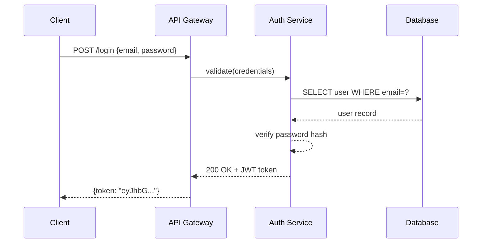
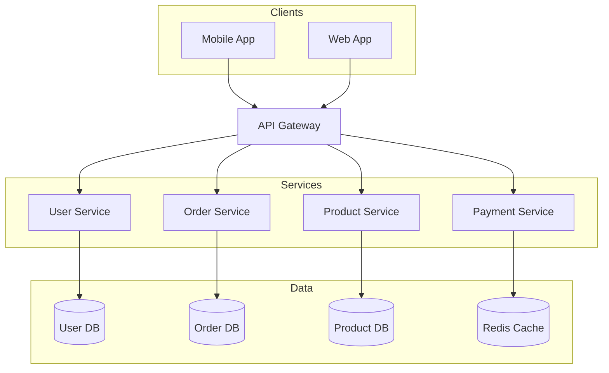
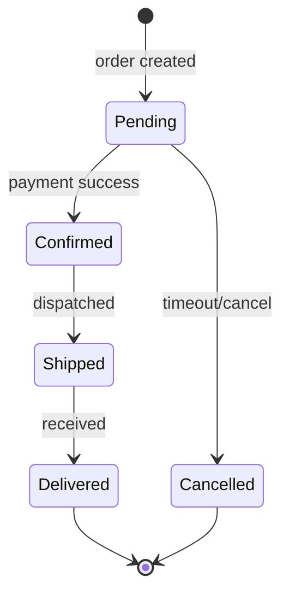
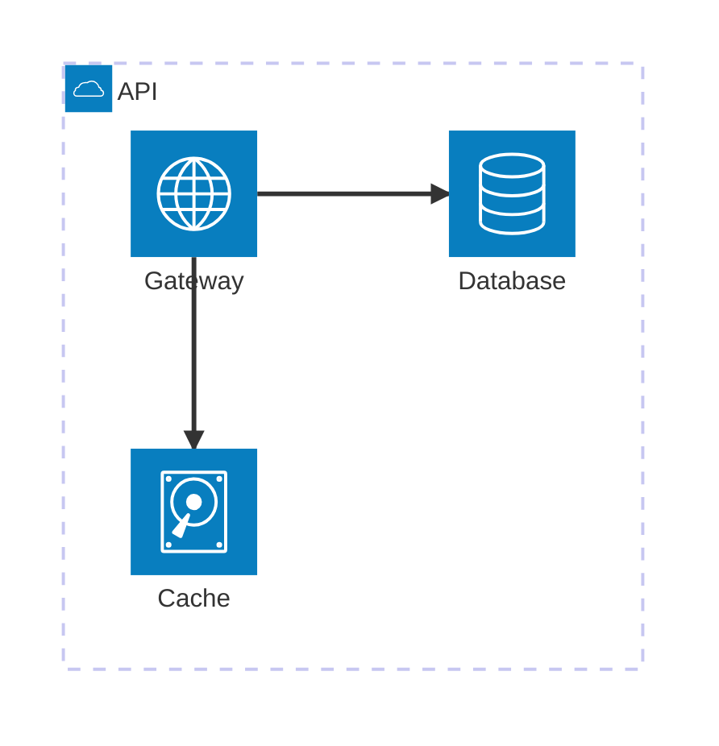

# Worked Examples

Four complete prompt → `.mmd` → output walkthroughs. Copy the structure, not the content.

## Example 1: API Authentication Flow

**User prompt:**
> Create a sequence diagram for JWT authentication

**Generated `.mmd`:**

**Output files:** `auth-flow.mmd` + `auth-flow.png`

## Example 2: Microservices Architecture

**User prompt:**
> Draw an e-commerce microservices architecture

**Generated `.mmd`:**

**Output files:** `ecommerce-arch.mmd` + `ecommerce-arch.png`

## Example 3: Order State Machine

**User prompt:**
> Show order lifecycle states

**Generated `.mmd`:**

**Output files:** `order-states.mmd` + `order-states.png`

## Example 4: Cloud Architecture

**User prompt:**
> Draw a simple service architecture for an API

**Generated `.mmd`:**

**Output files:** `api-architecture.mmd` + `api-architecture.png`
